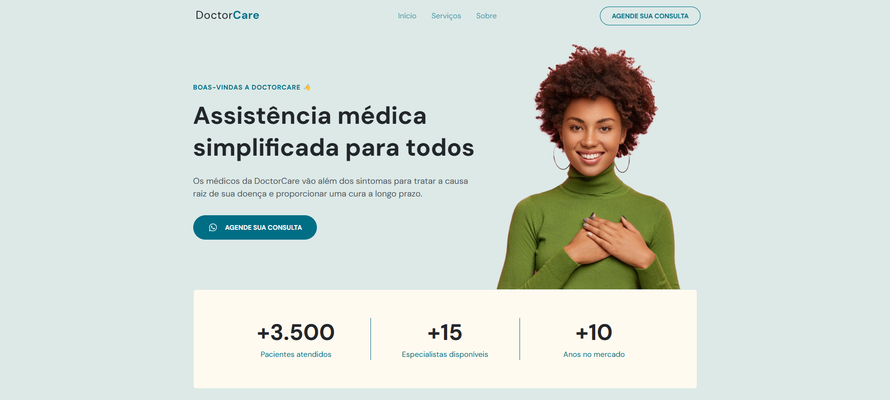

# DoctorCare

**DoctorCare** é um site criado junto da Rocketseat, focado em oferecer serviços de **assistência médica** de maneira intuitiva e eficiente. Este projeto foi uma ótima oportunidade para praticar e aprimorar habilidades em desenvolvimento web.

## Tecnologias Usadas

- **HTML**: Estruturação e marcação da página.
- **CSS**: Estilização do layout e responsividade para dispositivos móveis.
- **JavaScript**: Interatividade e dinamismo na interface.

## Aprendizados

Durante o desenvolvimento deste projeto, aprendi os seguintes conceitos:

- **HTML**: Criação de uma estrutura sólida de página com tags semânticas.
- **CSS**: Estilização de layout com ênfase em responsividade e boas práticas de design.
- **JavaScript**: Implementação de interações e funcionalidades dinâmicas.

## Funcionalidades

- **Design Responsivo**: O site é totalmente funcional em dispositivos móveis e desktops.
- **Interatividade**: Elementos dinâmicos criados com JavaScript.
- **Acessibilidade**: Foco em tornar o site acessível para diferentes tipos de usuários.

